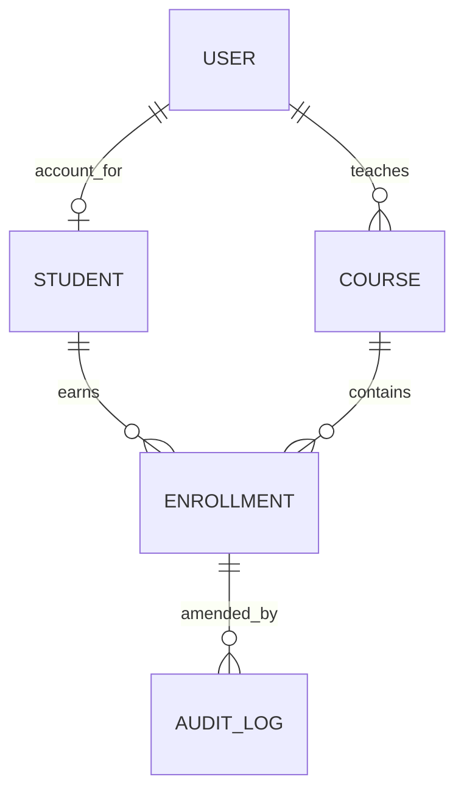

# Design decisions

## Data model and embed/reference choices

Students, courses, users, and audit records are separate collections because they are independently managed and referenced across requests. Enrollment stores ObjectId references to student and course, and a course's faculty is a User reference. Assessment marks are embedded in Enrollment because they are small, fixed-shape values read and amended with the result as one unit; separating each mark would add joins and make publication/auditing harder. `Enrollment` has a unique `(student, course)` index; `AuditLog` retains old/new values and reason.

## Aggregation location

Pipelines live in `backend/src/services/report.service.ts`. Controllers translate HTTP input/output and do not assemble database queries. Services own query/business behavior; routes declare middleware; models define schema and validation. `backend/src/app.ts` does not listen so Supertest can import it.

## Authorization matrix

`A` = allowed; `D` = denied; `O` = own record/course/department only.

| Endpoint group | Student | Faculty | HOD | Admin |
|---|---:|---:|---:|---:|
| Register/login/refresh/logout | A | A | A | A |
| Student record read (list is scoped to assigned roster/department) | O | O | O | A |
| Student create/update/delete | D | D | D | A |
| Course list/read | D | O | O | A |
| Course create/update/delete | D | D | D | A |
| Enrollment roster (individual read is own-record for students) | D | O | O | A |
| Enrollment create/update/publish/amend | D | O | O | A |
| Enrollment delete | D | D | D | A |
| Course summary/histogram | D | O | O | A |
| Transcript | O | A | A | A |
| Toppers | rank-only | A | A | A |
| CSV import | D | O | O | A |

`ownsCourse` re-reads course ownership from MongoDB on each request. Faculty are matched against `Course.faculty`; HODs are matched against department. Enrollments first resolve their course, then reuse the same ownership rule. The transcript IDOR check compares the requested student id to the authenticated user's linked student id before the pipeline runs. Student toppers projection never includes classmates' marks.

## Token storage decision

Short-lived access tokens are stored by the frontend so the API client can attach them to bearer requests and restore the UI during a refresh. This creates XSS exposure: injected same-origin script could read an access token. Refresh tokens are in an HttpOnly, SameSite=Lax cookie, so JavaScript cannot read them; the API enables credentialed CORS only for the configured frontend origin. SameSite and origin restrictions reduce CSRF exposure, while logout/password change rotate `refreshTokenVersion` and clear the stored refresh-token hash. For public HTTPS deployment, set `COOKIE_SECURE=true` and review cookie/CORS domains. A fully HttpOnly access-token design would further reduce XSS exposure but would need a different CSRF strategy.

## Event-loop decision

CSV import uses a read stream and 500-row batches with awaited `bulkWrite` calls. It avoids `readFileSync`, per-row serial saves, and holding the entire file in memory. Each batch yields to the event loop while database I/O is pending; progress is logged after batches. Use `npm run benchmark:toppers -w backend` for aggregation-vs-reduce wall time/RSS observations, then record machine-specific evidence in `evidence/`.

## HTTP conventions and UI

Validation failures return 422, absent records 404, duplicate unique records 409, creation 201, deletion/logout 204, authentication 401, authorization 403, and unexpected errors 500. Responses use a consistent `{ error }` shape. `X-Request-Id` and `X-SRMS-API-Version` are custom response headers. The React app uses one `api/client.ts`, controlled forms, protected routes, role-aware navigation, keyed lists, responsive hand-written CSS, and loading/error states.
